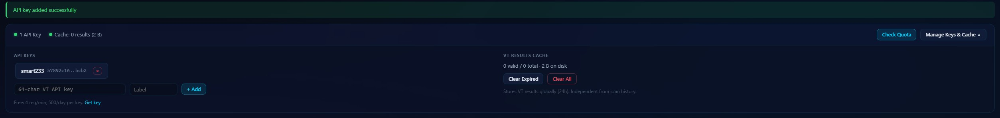
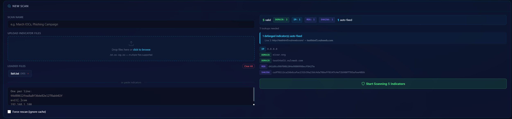
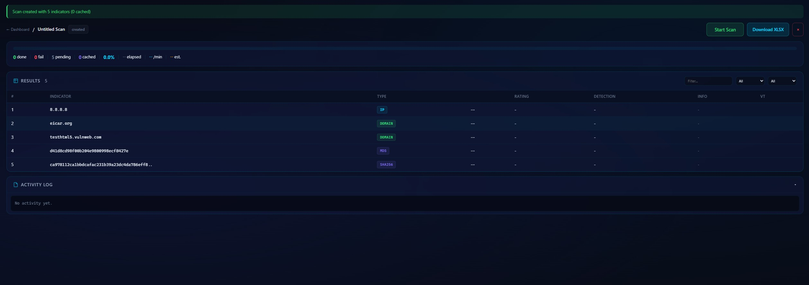
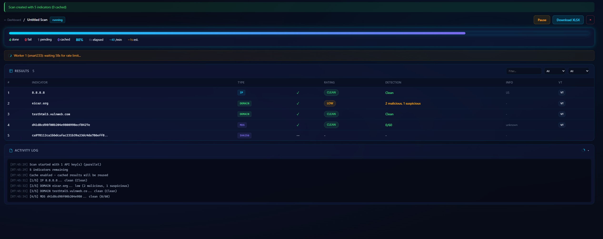
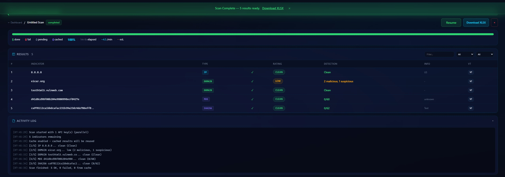
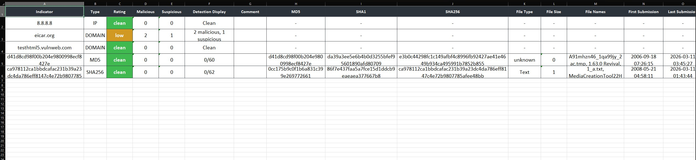

# VirusTotal Bulk Scanner

A web-based bulk scanner for VirusTotal with dark mode UI, multi-key parallel scanning, smart quota management, caching, and resume capability.

## Credits

This project is based on and extends the ideas and code from **[munin](https://github.com/Neo23x0/munin)** by [Neo23x0 (Florian Roth)](https://github.com/Neo23x0). I used that repository as a starting point and updated/enhanced it into this web-based bulk scanner (VT-only, multi-key, cache, quota handling, XLSX export, etc.). You can fork the [original munin repo](https://github.com/Neo23x0/munin) on GitHub to stay linked as a fork, or keep this as a separate project and link to it in your README (as done here) to credit the source.

## Features

- **Dark Mode Web UI** — modern dark interface with real-time progress
- **Bulk Scanning** — upload a text file or paste indicators (hashes, IPs, domains)
- **Multi-API Key Support** — add multiple VT API keys for parallel scanning
- **Smart Quota Management** — per-key rate limiting, auto-rotation, daily limit tracking
- **Resume Capability** — scans save state after every indicator; resume from where you left off
- **Results Cache** — skip previously scanned indicators to save API quota
- **VT Quota Display** — check real-time API usage per key before and during scans
- **Input Validation** — auto-detects indicator types, defangs IOCs, reports bad lines and duplicates
- **XLSX Export** — download styled Excel reports with detection details
- **Smart Port Handling** — if the default port is busy, the app finds a free one and opens your browser to the correct URL so you can always access the project

---

## Screenshots

The following screenshots (in the `screenshots/` folder) illustrate the workflow.

### 1. Starting the application

Run `start.bat`. The terminal shows setup (Python, venv, dependencies) and the final URL where the app is running. **Use the URL printed in the terminal** — if port 5000 is busy, the app switches to the next free port (e.g. 5001 or 5002) and prints that address. Your browser may open automatically to the correct page.



---

### 2. Dashboard home

Main dashboard with navigation, API keys area (collapsible), and the **Create new scan** section. From here you add VT API keys and start a new bulk scan.



---

### 3. API keys and cache

Configure VirusTotal API keys and manage the results cache (clear all or clear expired). Keys are stored so they persist after closing the app. Multiple keys enable parallel scanning and better use of quota.



---

### 4. Upload and validation

Upload one or more `.txt` files or paste indicators. Validation runs automatically and shows a summary: valid count, duplicates, rejected lines, and auto-fixed (defanged) indicators. Alerts and a paginated list keep large lists easy to review.



---

### 5. Scan in progress

Scan detail page while a run is active: progress bar, done/fail/pending/cached counts, elapsed time, speed (per minute), and ETA. You can pause or resume; state is saved so you can resume after quota limits or accidental refresh.



---

### 6. Results and export

Completed scan with results table (indicator, type, status, detection ratio, etc.). Use **Download XLSX** to export a styled Excel report. Results can include cached entries to save API quota.



---

## Quick Start (Windows)

1. Double-click **`start.bat`**.
2. Wait for “Open http://127.0.0.1:XXXX in your browser” (or for your browser to open automatically).
3. If the default port was busy, the app uses the next free port — **always use the URL shown in the terminal**.
4. Add your VirusTotal API key(s) on the dashboard and start scanning.

## Manual Start

```bash
pip install -r requirements.txt
python web_app.py [--port 5000]
```

If you omit `--port`, the app finds a free port (5000–5019) and prints the URL. Open that address in your browser.

## Usage

1. **Add API Keys** — paste your VT API key(s) on the dashboard.
2. **Check Quota** — see daily usage before scanning.
3. **Upload Indicators** — upload `.txt` file(s) or paste indicators.
4. **Preview & Validate** — review valid/duplicate/rejected/auto-fixed counts and alerts.
5. **Start Scan** — parallel workers use all configured keys.
6. **Download XLSX** — export results at any time.

## Indicator Types Supported

| Type   | Example |
|--------|---------|
| MD5    | `44d88612fea8a8f36de82e1278abb02f` |
| SHA1   | `3395856ce81f2b7382dee72602f798b642f14140` |
| SHA256 | `e3b0c44298fc1c149afbf4c8996fb924...` |
| IPv4   | `8.8.8.8` |
| Domain | `example.com` |

Defanged indicators (`hxxp://`, `[.]`, etc.) are automatically cleaned.

## Requirements

- Python 3.8+
- Internet connection
- VirusTotal API key (free tier: 4 req/min, 500 req/day per key)

Get your API key at [virustotal.com/gui/my-apikey](https://www.virustotal.com/gui/my-apikey).

## Project structure

```
├── web_app.py          # Flask app and API
├── scanner_engine.py   # VT scanning, cache, quota logic
├── start.bat          # Windows: setup and run
├── requirements.txt
├── README.md
├── templates/          # HTML (base, index, scan)
├── static/
│   └── images/
│       └── logo.png    # Dashboard logo
├── screenshots/       # Screenshots 1–6 for README
└── data/              # Created at runtime (config, cache, scans)
```

When sharing or publishing: ensure `data/` has no API keys or scan results (clear `data/config.json` and `data/vt_cache.json`, and remove `data/scans/` if present). The app creates empty `data/` on first run.

**Optional:** Add a `screenshots/` folder with images `1.jpg`–`6.jpg` if you want the README screenshot links to work (see "Screenshots" section above).
